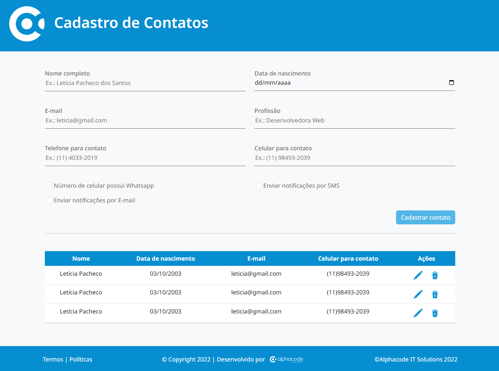

# Cadastro de Contatos


Este é um projeto de **Cadastro de Contatos** que permite ao usuário adicionar informações como nome completo, data de nascimento, e-mail, profissão, telefone e celular. A aplicação foi desenvolvida com **HTML5**, **CSS**, **JavaScript** e **Bootstrap**, garantindo um layout responsivo e uma boa experiência do usuário.

## Funcionalidades

- Armazenamento de dados como nome, data de nascimento, e-mail e telefone.
- Excluir contatos através de um modal de confirmação.
- Editar contatos (a funcionalidade de edição está preparada, mas o código para edição precisa ser adicionado).
- Design responsivo para telas móveis e desktop.
  
## Tecnologias Utilizadas

- **HTML5**: Para a estrutura do conteúdo da página.
- **CSS3**: Customização do estilo e responsividade.
- **JavaScript**: Para a lógica de adicionar e listar contatos dinamicamente.
- **Bootstrap 5**: Biblioteca utilizada para criar um design responsivo e estiloso de forma rápida.

## Instalação

1. Clone este repositório para o seu ambiente local:
   ```bash
   git clone https://github.com/seu-usuario/nome-do-repositorio.git
   ```
2. Abra o arquivo index.html em seu navegador preferido.

## Como Usar
1. **Adicionar Contato**: Preencha o formulário na parte superior da página com as informações do contato e clique em "Cadastrar".
2. **Excluir Contato**: Clique no ícone de "Excluir" ao lado do contato que deseja remover. Confirme a exclusão no modal que aparece.
3. **Editar Contato**: A funcionalidade de edição está preparada, mas você precisa adicionar a lógica correspondente.